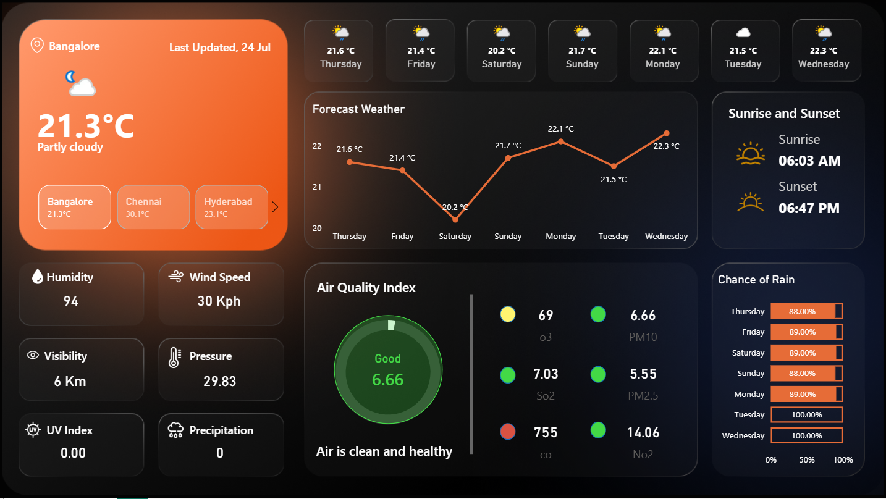

# 🌦️ Live Weather Forecast Dashboard using Power BI + API

> Real-time weather insights powered by WeatherAPI & Power BI with JSON and DAX

## 🔗 Live Preview
- 

## 📌 Project Features
- Real-time API connection using `Web.Contents`
- 5-city weather monitoring (Hyderabad, Mumbai, Chennai, Bangalore, Noida)
- Current, Hourly & 7-Day Forecast
- Custom visuals: Temperature, Rain % Chance, Air Quality Index, Sunrise/Sunset
- Conditional formatting using DAX
- Icons via dynamic image URLs
- Auto-refresh using Power BI Service

## 🔧 How to Use
1. Replace API key in Power Query with your own key
2. Add more cities by duplicating base query and changing city name in the `q` parameter
3. Append queries as a master table
4. Reference 3 tables: `Current`, `Forecast_day`, `Forecast_hour`
5. Create DAX measures as listed in `docs/setup-instructions.md`
6. Design report and publish to Power BI Service for auto-refresh

## 💡 Tech Stack
- Power BI, DAX, Power Query, WeatherAPI, JSON

## 📂 Files
- `Live_Weather_Dashboard.pbix` – Main Power BI report
- `/assets/` – Dashboard preview images & icons
- `/docs/` – DAX logic and setup guide

